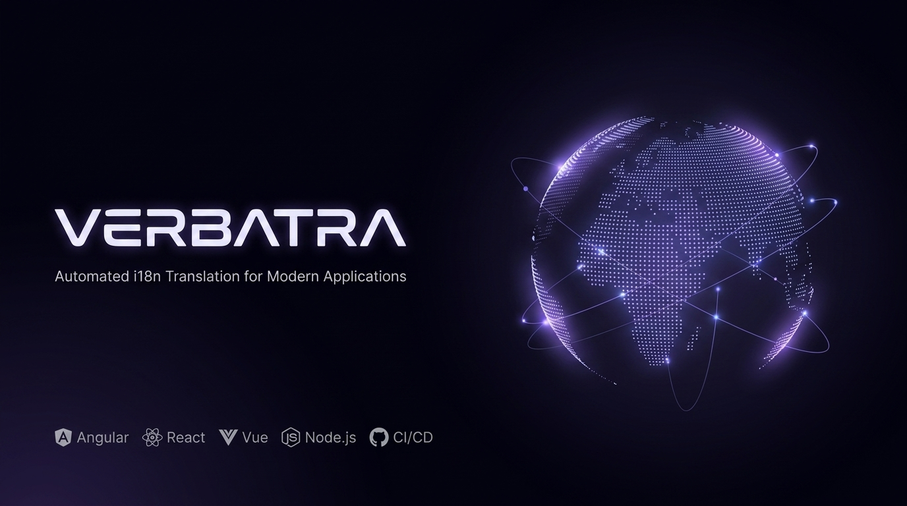

<p align="center">
  
</p>

<h1 align="center">verbatra</h1>

<p align="center">
  Automate i18n translation and keep your locale files in sync across languages with AI and machine-translation providers.
</p>

<p align="center">
  <a href="https://www.npmjs.com/package/@verbatra/cli"></a>
  <a href="https://www.npmjs.com/package/@verbatra/sdk"></a>
  <a href="https://github.com/mariokreitz/verbatra/actions/workflows/ci.yml"></a>
  <a href="https://codecov.io/gh/mariokreitz/verbatra"></a>
  <a href="https://www.npmjs.com/package/@verbatra/cli"></a>
  <a href="./LICENSE"></a>
</p>

## Description

verbatra translates your application's locale files for you. You maintain the source locale by hand, and as strings are added or change, verbatra fills in every target locale through the AI or machine-translation provider you choose. It records what it has already translated, so each run touches only what actually changed.

It ships in three packages. `@verbatra/cli` gives you a `verbatra` command for the terminal and CI, `@verbatra/sdk` is the same engine as a programmatic API, and `@verbatra/studio` is a local web dashboard served through the `verbatra studio` command. verbatra is built SDK-first: the CLI is a thin wrapper over the SDK, so anything the command line does, you can also do in code.

## Features

- **Many locale formats.** JSON for i18next, vue-i18n, next-intl, and ngx-translate, plus XLIFF, YAML, ARB, and Java/Spring properties.
- **Five providers** behind one interface: Anthropic, OpenAI, Gemini, and openai-compatible (a local or self-hosted server such as LM Studio, Ollama, or vLLM) as LLMs, plus DeepL (machine translation).
- **Incremental by default.** A lock file records what has been translated, so each run sends only new or changed strings to the provider.
- **Project scaffolding.** `verbatra init` writes a config and a `.env.example` for your project.
- **Dry runs.** `--dry-run` previews what would change without calling a provider or writing files.
- **Read-only status and diff.** `verbatra check` reports per-locale missing, stale, and up-to-date counts, and `verbatra diff` lists the exact keys that would be added, re-translated, or are orphaned. Both write nothing and exit non-zero when locales are out of sync, so they slot into CI.
- **Watch mode.** `verbatra watch` re-translates automatically on every source change.
- **Manual translation.** `verbatra export` writes the strings that need translating to a styled Excel workbook for a human translator, and `verbatra import` reads the filled file back with the same safety checks as an automated run.
- **Placeholder integrity.** Every translation is checked after the fact; a result that drops or alters a placeholder is withheld and reported rather than written.
- **Lossless key round-trip.** Literal dotted leaf keys (such as `"foo.bar"` used as a single leaf) and real nested paths each keep their on-disk shape. A genuine collision, where one file expresses the same effective path both as a literal dotted leaf and as a real nested path, errors with `INVALID_STRUCTURE` rather than guessing or corrupting data. See the [Formats page](https://verbatra.kreitz-webdev.de/docs/formats) for the full behavior.
- **Document key order preserved.** JSON-family, YAML, and ARB files round-trip in exact document key order: integer-like keys keep their position, and new keys append in source-document order. A YAML composite key (a map or sequence used as a mapping key) fails with a structured error instead of being silently mangled.
- **Opt-in cleanup and plural generation.** Orphan pruning (`--prune` / `prune`) and CLDR plural-category generation (`generatePlurals`) are off by default and documented on the [Configuration page](https://verbatra.kreitz-webdev.de/docs/config-file).
- **Keys stay in your environment.** API keys are read only from environment variables, never from the config.

## Requirements

Node.js `>=22.14.0`.

## Installation

verbatra is a development dependency:

```bash
pnpm add -D @verbatra/cli
# npm
npm install -D @verbatra/cli
# yarn
yarn add -D @verbatra/cli
```

## Quick start

```bash
# 1. Install as a dev dependency
pnpm add -D @verbatra/cli

# 2. Scaffold verbatra.config.ts and .env.example (choose your provider)
verbatra init --provider anthropic

# 3. Provide the provider's API key. init created .env.example and gitignored
#    .env, so you can set it in .env, or export it (Anthropic shown):
export ANTHROPIC_API_KEY=your-key-here

# 4. Translate every target locale once
verbatra translate
```

Invoke the binary through your package manager: `pnpm verbatra ...`, `npx verbatra ...`, or `yarn verbatra ...`.

## Configuration

verbatra looks for its configuration upward from the working directory: a `verbatra.config.ts`, a `.verbatrarc.json` (and the other `.verbatrarc.*` variants), or a `"verbatra"` key in `package.json`. The quickest way to get a valid one is `verbatra init`. A minimal `verbatra.config.ts`:

```ts
import { defineConfig } from "@verbatra/sdk";

export default defineConfig({
  sourceLocale: "en",
  targetLocales: ["de", "fr"],
  format: "i18next-json",
  files: {
    pattern: "locales/{locale}.json",
  },
  provider: {
    id: "anthropic",
    options: {
      model: "claude-sonnet-4-6", // replace with your provider's model id
      maxTokens: 4096,
    },
  },
});
```

`files.pattern` must contain the `{locale}` token, and `targetLocales` must not include `sourceLocale`. The supported `format` values are `i18next-json`, `vue-i18n-json`, `next-intl-json`, `ngx-translate-json`, `xliff`, `yaml`, `arb`, and `properties`. The optional `glossary` (a term map) and `tone` (`"formal"`, `"informal"`, or `"neutral"`) refine the output.

The `provider` block is selected by `id`. The LLM providers take a `model` and a token limit; DeepL needs no model:

```ts
// OpenAI / Gemini
provider: { id: "openai", options: { model: "gpt-5.4-mini", maxOutputTokens: 4096 } }

// DeepL (machine translation)
provider: { id: "deepl", options: {} }
```

Each provider reads its API key from one environment variable:

| Provider id | Environment variable |
| --- | --- |
| `anthropic` | `ANTHROPIC_API_KEY` |
| `openai` | `OPENAI_API_KEY` |
| `gemini` | `GEMINI_API_KEY` |
| `deepl` | `DEEPL_API_KEY` |

`openai-compatible` is not in this table: most local servers need no key at all, and when one is required you name your own environment variable for it. See the [Providers page](https://verbatra.kreitz-webdev.de/docs/providers) for its key resolution.

## Commands

| Command | What it does | Common flags |
| --- | --- | --- |
| `verbatra init` | Create a verbatra config and .env example for this project | `--provider <id>`, `--source`, `--targets`, `--path`, `--yes`, `--force` |
| `verbatra translate` | Translate every target locale once, then exit | `--cwd`, `--config`, `--dry-run`, `--prune`, `--json` |
| `verbatra watch` | Re-translate on every source change until interrupted | `--cwd`, `--config`, `--debounce <ms>`, `--json` |
| `verbatra check` | Report per-locale missing, stale, and up-to-date counts without writing (read-only) | `--cwd`, `--config`, `--locales`, `--json` |
| `verbatra diff` | List the keys per locale that would be added, re-translated, or are orphaned, without writing (read-only) | `--cwd`, `--config`, `--locales`, `--json` |
| `verbatra export` | Export untranslated strings into a styled Excel workbook for a human translator | `--out`, `--locales`, `--include-unchanged`, `--cwd`, `--config`, `--json` |
| `verbatra import <workbook>` | Import a filled workbook back into the locale files, with the same safety checks | `--dry-run`, `--cwd`, `--config`, `--json` |
| `verbatra studio` | Start Verbatra Studio, a local web dashboard over the project | `--port`, `--allow-spend`, `--cwd`, `--config` |

Run `verbatra <command> --help` for the full option list. The complete command reference - every flag, examples, and the exit-code contract - lives on the [documentation site](https://verbatra.kreitz-webdev.de/docs/cli).

## Verbatra Studio

`verbatra studio` starts Verbatra Studio, a local web dashboard over your project with four pages: Translations (per-locale status, the diff, and lock drift, down to a per-key detail view), Review (the needs-review queue, where you can edit a translation in place), Activity (a live feed of locale-file changes and the last run's token usage and budget), and Settings (your resolved config, glossary, and the session's capabilities). Every page refreshes live over a server-sent event stream as your locale files change.

Local editing is always on: an edit from the Review queue goes through the same placeholder and ICU integrity checks as a translate run, then writes the locale file and the lock. Actions that spend provider budget (retranslating a key, translating pending changes) exist only when you start Studio with `--allow-spend` or set `VERBATRA_STUDIO_ALLOW_SPEND`; without that flag, Studio never calls a provider. The server binds to `127.0.0.1` only and gates every request behind a per-session token.

```bash
verbatra studio
# Verbatra Studio running at http://127.0.0.1:5849/?token=...
```

Studio ships as its own package; install both as dev dependencies:

```bash
pnpm add -D @verbatra/cli @verbatra/studio
```

See the [Verbatra Studio docs](https://verbatra.kreitz-webdev.de/docs/cli/studio) for the full command reference and security model.

## Programmatic use

Everything the CLI does is available from `@verbatra/sdk`:

```ts
import { loadConfig, translate } from "@verbatra/sdk";

// Discovers and validates verbatra.config.ts (or .verbatrarc.json, or a package.json "verbatra" key).
const config = await loadConfig();

// The provider reads its API key from the environment (e.g. ANTHROPIC_API_KEY). No key is passed.
const summary = await translate({ config });

console.log(`${summary.succeeded.length} locale(s) translated, ${summary.failed.length} failed`);
```

The manual-translation workflow is available too, with `exportWorkbook` and `importWorkbook`:

```ts
import { exportWorkbook, importWorkbook, loadConfig } from "@verbatra/sdk";

const config = await loadConfig();

// Export the strings that need translating to an Excel workbook.
const { path } = await exportWorkbook({ config });

// ...a human fills the Translation column, then import the file back.
const summary = await importWorkbook({ config, workbook: path });
```

See the [`@verbatra/sdk` README](./packages/sdk/README.md) for the full API.

## Packages

| Package | Description |
| --- | --- |
| [`@verbatra/cli`](./packages/cli/README.md) | The `verbatra` command-line tool. |
| [`@verbatra/sdk`](./packages/sdk/README.md) | The programmatic API. |
| [`@verbatra/studio`](./packages/studio/README.md) | The local Verbatra Studio dashboard, served through `verbatra studio`. |

## Security

API keys are read only from environment variables, never from the config file. The config schema rejects unknown keys, so a key cannot hide there by accident, and `verbatra init` adds `.env` and `.env.local` to your `.gitignore`. To report a vulnerability, see [SECURITY.md](./SECURITY.md).

## Documentation

The hosted documentation site at [verbatra.kreitz-webdev.de](https://verbatra.kreitz-webdev.de) is the canonical reference, including the full [CLI command reference](https://verbatra.kreitz-webdev.de/docs/cli). The [`@verbatra/sdk` README](./packages/sdk/README.md) documents the programmatic API. At the terminal, `verbatra <command> --help` prints the same command reference.

## Contributing

Contributions are welcome. Please read [CONTRIBUTING.md](./CONTRIBUTING.md) and our [Code of Conduct](./CODE_OF_CONDUCT.md) first.

## License

[MIT](./LICENSE) (c) Mario Kreitz
